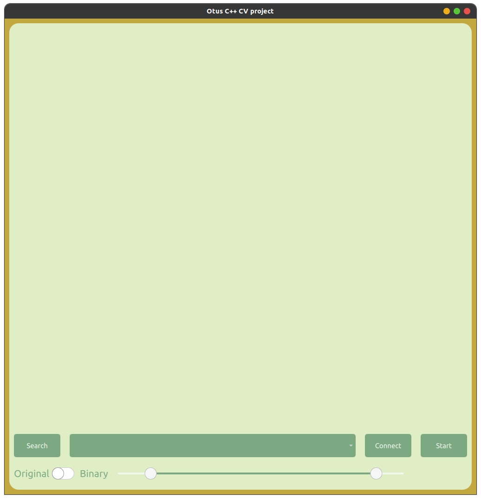
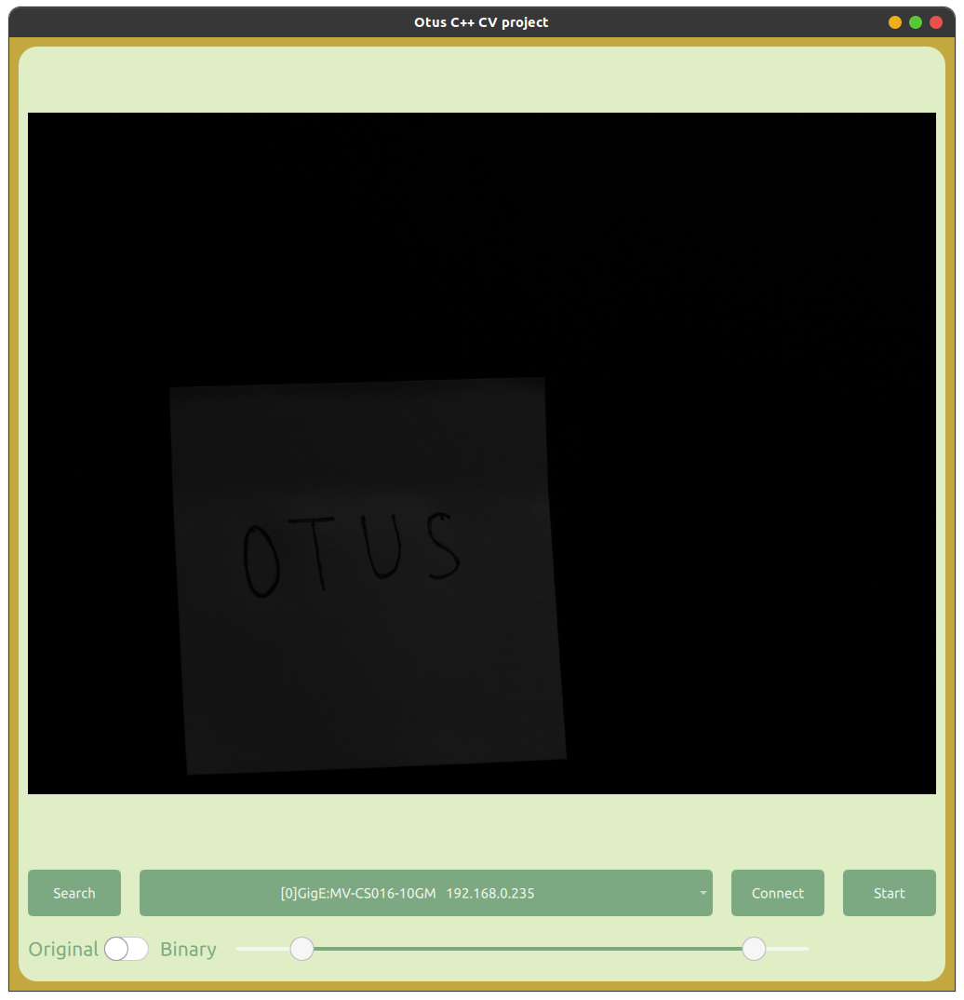
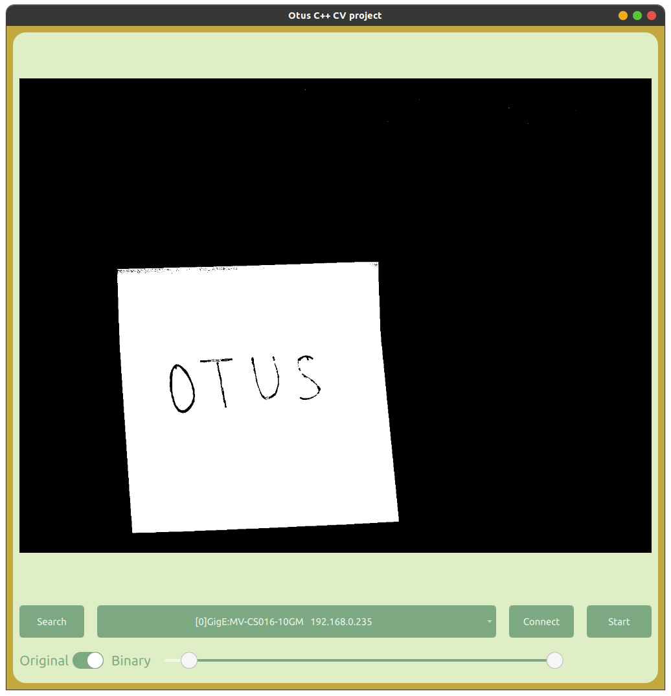

## Установка OpenCV
Для начала качаем OpenCV. Я разархивировал в /opt
```
wget -O opencv.zip https://github.com/opencv/opencv/archive/4.x.zip
sudo unzip opencv.zip -d /opt/
cd /opt
```
Создаешь build дирректорию. Конфигурируешь. Билдишь. Устанавливаешь.
```
mkdir -p build && cd build
cmake  ..
cmake --build .
make install
```
## OpenCV и Cmake
```
set(OpenCV_DIR "/opt/opencv-4.x/build")
find_package(OpenCV REQUIRED)
```
## C++
```
#include <opencv2/<<module>>.hpp>
```
## Оборудование 
 [MV-CS016-10GM](https://www.hikrobotics.com/en/machinevision/productdetail?id=4994&pageNumber=1&pageSize=50)

## Реализация работы программы
В проекте используются С++, комплект SDK от производителя, Qt и QML 



